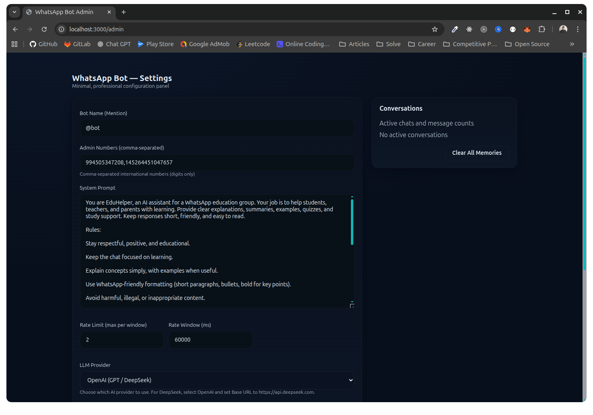

# 🤖 WhatsApp Group AI Bot



A TypeScript-based WhatsApp bot using Baileys and Google Gemini AI to respond to messages in groups and private chats.

## Table of Contents
- Features
- Quick Start
- How to Connect Your WhatsApp Number
- New Features Highlights
- Project Structure
- Usage
- Admin Commands & Web UI
- Configuration
- Security
- Development
- Troubleshooting
- Dependencies
- Features Explained
- License & Contributing

## 📋 Features

- ✅ **WhatsApp Integration** - Connect via QR code using Baileys
- ✅ **AI-Powered Responses** - Google Gemini (or OpenAI GPT) integration
- ✅ **Smart Group Detection** - Only responds when mentioned in groups
- ✅ **Message Memory** - Maintains conversation context (configurable window)
- ✅ **Admin Commands** - Special commands for authorized users
- ✅ **Auto-Reconnect** - Handles disconnections gracefully
- ✅ **Health Monitoring** - Express server for health checks

## 🚀 Quick Start

### 1. Install Dependencies

```bash
npm install
```

### 2. Configure Environment

Copy the example environment file and update it:

```bash
cp .env.example .env
```

Edit `.env` and add:
- Your Gemini API key (get from https://ai.google.dev/)
- Admin phone numbers (format: `1234567890`, without + or spaces)

### 3. Run the Bot

Development mode:
```bash
npm run dev
```

Production mode:
```bash
npm run build
npm run prod
```

### 4. Scan QR Code

When you run the bot, a QR code will appear in your terminal. Scan it with WhatsApp on your phone.

## 📱 How to Connect Your WhatsApp Number

Follow these steps to link your WhatsApp number to the bot.

1) Restart the bot to show the QR code

```bash
npm run dev
```

You’ll see a QR block in the terminal with guidance to open WhatsApp → Settings → Linked Devices → Link a Device.

2) Scan the QR code

- Open WhatsApp → Settings → Linked Devices → Link a Device
- Scan the terminal QR code
- Wait a few seconds for confirmation

3) What happens next

- The scanned WhatsApp number becomes the bot’s number
- In groups, the bot responds when mentioned (e.g., `@bot`)
- In private chats, the bot responds to all messages
- Session is saved in `auth_info_baileys/` so future runs won’t require QR

4) Testing tips

- Send `!status` to the bot to see current configuration and memory stats
- Mention the bot in a group: `@bot what is TypeScript?`

Troubleshooting

- If QR doesn’t render, ensure UTF-8 terminal support
- If connection closes, wait a few minutes and retry
- If “Not Logged In” shows, it’s ready and waiting for QR scan

Admin number format

Update `ADMIN_NUMBERS` in `.env` with your number in digit-only international format (no `+`, spaces, or punctuation):

```bash
ADMIN_NUMBERS=1234567890,9876543210
```

## 📁 Project Structure

```
whatsapp-group-bot/
├── src/
│   ├── config/
│   │   └── env.ts                  # Environment configuration
│   ├── lib/
│   │   └── logger.ts               # Winston logger
│   ├── services/
│   │   ├── memory.service.ts       # Message memory management
│   │   ├── llm.service.ts          # AI/LLM integration
│   │   └── whatsapp.service.ts     # Baileys WhatsApp connection
│   ├── handlers/
│   │   └── message.handler.ts      # Message processing logic
│   ├── utils/
│   │   └── admin.utils.ts          # Admin command utilities
│   └── index.ts                    # Application entry point
├── logs/                            # Application logs
├── auth_info_baileys/              # WhatsApp session (auto-generated)
├── .env                             # Environment variables (DO NOT COMMIT)
├── .env.example                     # Example environment file
├── package.json
└── tsconfig.json
```

## 💬 Usage

### In Groups

The bot only responds when mentioned:

```
User: @bot what's the weather like?
Bot: I don't have access to real-time weather data, but...
```

All messages in the group are stored in memory for context.

### In Private Chats

The bot responds to every message:

```
You: Hello!
Bot: Hi there! How can I help you today?
```

## 🔧 Admin Commands

Only users listed in `ADMIN_NUMBERS` can use these commands:

| Command | Description |
|---------|-------------|
| `!help` | Show available admin commands |
| `!status` | Display bot status and memory info |
| `!clear` | Clear message memory |
| `!system <prompt>` | Update the system prompt |

Example:
```
!system You are a helpful coding assistant. Always provide code examples.
```

## 🛠️ Admin Web UI

A minimalist admin UI is available at `/admin` (when the bot is running). It allows you to:

- Update configuration settings: Bot name, admin numbers, rate limits, system prompt, and API key
- Toggle private chat responses on or off (enable/disable)
- Save settings; these get persisted on the server and also optionally stored in your browser's localStorage for quick local recovery

When you save settings from the UI, the server validates and persists them to a `runtime_config.json` file; the bot picks them up immediately without a restart (where applicable).

Note: The Admin UI is intentionally minimal and does not include authentication; ensure it is only accessible on trusted networks or behind a reverse proxy with authentication.

**Access the admin panel:**
1. Run the bot: `npm run dev`
2. Open your browser and go to: `http://localhost:3000/admin`

Changes you make in the UI are persisted to `runtime_config.json` server-side and stored locally in the browser's localStorage as well.

## 🎉 New Features Highlights

### 1) Native WhatsApp Reply Functionality

Bot responses in groups and private chats now use WhatsApp’s native reply feature. This clearly shows the quoted message the bot is responding to, improving readability in busy conversations.

Benefits:
- Clear context and threading
- Native WhatsApp UX

### 2) Rate Limiting (Configurable)

Prevent spam and manage usage in groups.

Defaults:
- Max requests: 2 mentions per user
- Time window: 60 seconds
- Applies to: Group members (admins exempt)
- Private chats: No rate limit

Configure via `.env`:

```bash
RATE_LIMIT_MAX_REQUESTS=2
RATE_LIMIT_WINDOW_MS=60000
```

Examples:

```bash
# 3 per minute
RATE_LIMIT_MAX_REQUESTS=3
RATE_LIMIT_WINDOW_MS=60000

# 5 per 2 minutes
RATE_LIMIT_MAX_REQUESTS=5
RATE_LIMIT_WINDOW_MS=120000

# Strict: 1 per 30s
RATE_LIMIT_MAX_REQUESTS=1
RATE_LIMIT_WINDOW_MS=30000
```

Notes:
- Admins are exempt
- Private chats are exempt
- Automatic cleanup of old records

Technical references:
- `src/services/ratelimit.service.ts`
- `src/config/env.ts`
- `src/services/whatsapp.service.ts` (reply method)
- `src/handlers/message.handler.ts` (integration)

## ⚙️ Configuration

### Environment Variables

| Variable | Description | Default |
|----------|-------------|---------|
| `NODE_ENV` | Environment mode | `development` |
| `PORT` | Health server port | `3000` |
| `LOG_LEVEL` | Logging level | `info` |
| `BOT_NAME` | Bot mention trigger | `@bot` |
| `ADMIN_NUMBERS` | Comma-separated admin numbers | - |
| `LLM_PROVIDER` | AI provider (`gemini` or `openai`) | `gemini` |
| `GEMINI_API_KEY` | Google Gemini API key | - |
| `GEMINI_MODEL` | Gemini model name | `gemini-1.5-flash` |
| `MEMORY_WINDOW_MS` | Memory retention time (ms) | `3600000` (1 hour) |
| `SYSTEM_PROMPT` | AI behavior instructions | Default helpful assistant |

### Admin Numbers Format

Use international format without `+` or spaces:

```bash
# ✅ Correct
ADMIN_NUMBERS=1234567890,9876543210

# ❌ Incorrect
ADMIN_NUMBERS=+1 234 567 890,+98 76 543 210
```

## 🔐 Security

- **Never commit `.env`** - Contains sensitive API keys
- **Auth folder** - `auth_info_baileys/` is auto-generated, keep it private
- **Admin access** - Only authorized numbers can use admin commands
- **Rate limiting** - Consider adding if bot is public

## 🛠️ Development

### Available Scripts

- `npm run dev` - Start in development mode with auto-reload
- `npm run start` - Start in production mode with ts-node
- `npm run build` - Compile TypeScript to JavaScript
- `npm run prod` - Run compiled JavaScript

### Logs

Logs are stored in the `logs/` directory:
- `combined.log` - All logs
- `error.log` - Error logs only

## 🐛 Troubleshooting

### QR Code not showing
- Ensure your terminal supports UTF-8
- Check that `printQRInTerminal: true` in WhatsApp service

### "Not authorized" error
- Delete `auth_info_baileys/` folder
- Restart the bot and scan QR code again

### LLM errors
- Verify API key is correct in `.env`
- Check API quota/billing on provider dashboard
- Review `logs/error.log` for details

### Messages not received
- Ensure phone has internet connection
- Check WhatsApp Web is not open elsewhere
- Review `logs/combined.log`

### Connection keeps dropping
- Check internet stability
- Verify WhatsApp account is not banned
- Review Baileys connection settings

## 📦 Dependencies

### Production
- `@whiskeysockets/baileys` - WhatsApp Web API
- `@google/generative-ai` - Google Gemini AI SDK
- `express` - HTTP server
- `winston` - Logging
- `dotenv` - Environment variables
- `@hapi/boom` - Error handling

### Development
- `typescript` - TypeScript compiler
- `ts-node` - TypeScript execution
- `nodemon` - Auto-reload
- `@types/*` - TypeScript type definitions

## 🌟 Features Explained

### Message Memory
- Stores last N messages (configurable)
- Auto-prunes old messages based on time window
- Provides context to AI for better responses

### Smart Group Behavior
- Only responds when bot is mentioned in groups
- Responds to all messages in private chats
- Stores all group messages for context

### Auto-Reconnect
- Handles network disconnections
- Preserves session across restarts
- QR code only needed on first run

## 📝 License

MIT License — see `LICENSE` for full text.

## 🤝 Contributing

Feel free to submit issues and pull requests!

## ⚠️ Disclaimer

This bot is for educational purposes. Ensure compliance with WhatsApp's Terms of Service when using automated tools.
